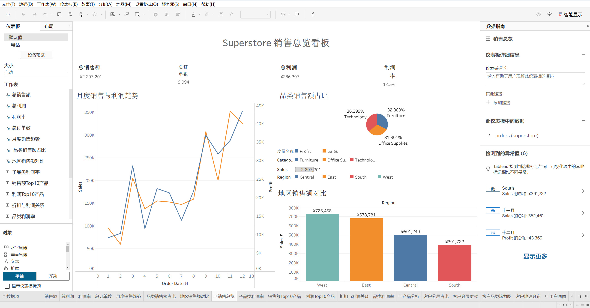
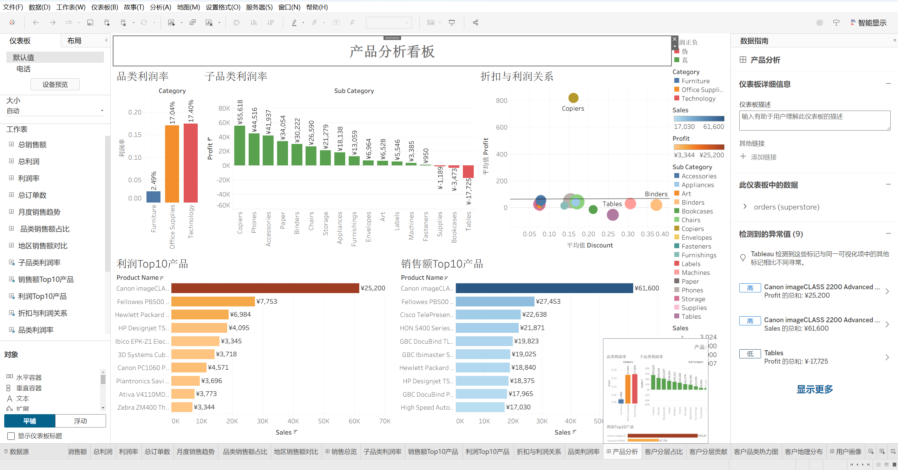
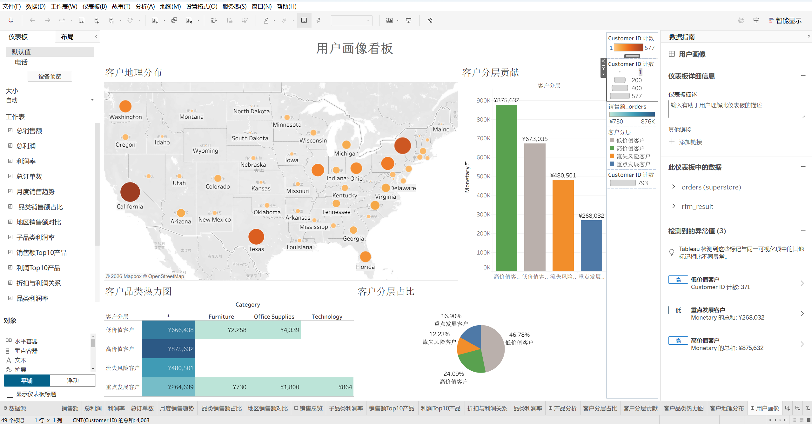

# Superstore 销售数据分析

> 🎓 上海对外经贸大学 | 数据科学与大数据技术 | 李诗甜

## 项目背景

使用 Superstore 数据集（约 10,000 条零售订单记录），模拟零售企业数据分析场景，从**整体趋势、产品表现、地区差异、用户分层**四个维度进行深入分析，发现业务问题和增长机会。

## 技术栈

| 技术 | 用途 |
|------|------|
| **MySQL** | 数据存储、SQL 查询分析（CTE、窗口函数、RFM 模型） |
| **Tableau** | 可视化看板搭建（3 个仪表板，12 张工作表） |
| **Python** | 数据导入、编码处理 |

## 分析框架

## 核心发现

### 📊 看板一：销售总览

> **关键结论：**
> - 总销售额 2297200.86 万，总利润 286397.02 万，整体利润率 12.47%
> - 销售额呈逐年上升趋势，20XX 年达到峰值
> - Technology 品类销售额占比最高（约 36.399%）

---

### 📦 看板二：产品分析

> **关键结论：**
> - Tables 子品类严重亏损，建议重新评估供应链
> - 销售额 Top 10 产品 ≠ 利润 Top 10 产品，高销量不一定高利润
> - 折扣与利润呈明显负相关（趋势线向下），建议控制折扣力度

---

### 👤 看板三：用户画像（RFM 分析）

> **关键结论：**
> - 高价值客户占比约 24.09%，贡献约 38.12% 的销售额
> - 流失风险客户占 XX%，建议发放优惠券召回
> - California 地区客户最密集，但利润率偏低

---

## 项目结构

## SQL 分析模块

| 模块 | 内容 | 核心 SQL 技术 |
|------|------|--------------|
| 整体概览 | 总销售额/利润/利润率、年度趋势 | GROUP BY, 聚合函数 |
| 产品分析 | 品类/子品类利润、亏损产品、折扣分析 | HAVING, CASE WHEN |
| 地区分析 | 区域对比、Top/Bottom 州、交叉分析 | 多维度 GROUP BY |
| RFM 用户分层 | R/F/M 计算、NTILE 打分、四层分类 | CTE, NTILE, 窗口函数 |
| 时间趋势 | 月度趋势、季度对比、环比增长 | LAG, DATE_FORMAT |

## 关于本项目

这是我的数据分析的实践项目，完整呈现了从 **SQL 取数 → 指标分析 → 可视化看板 → 业务洞察** 的全流程。

欢迎通过邮箱联系我：3820818598@qq.com
